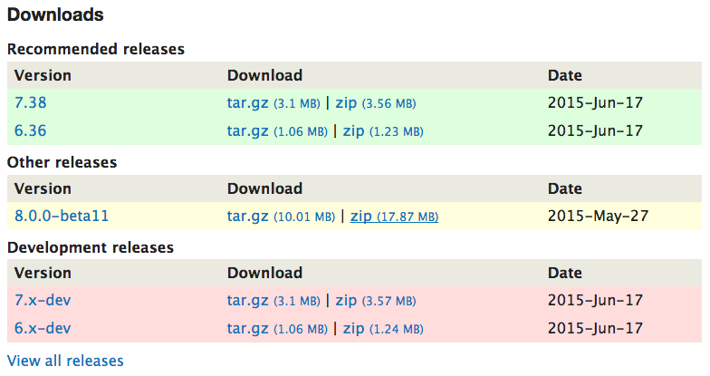
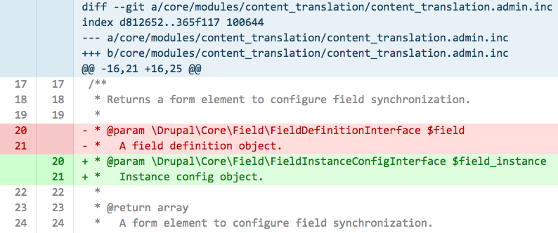
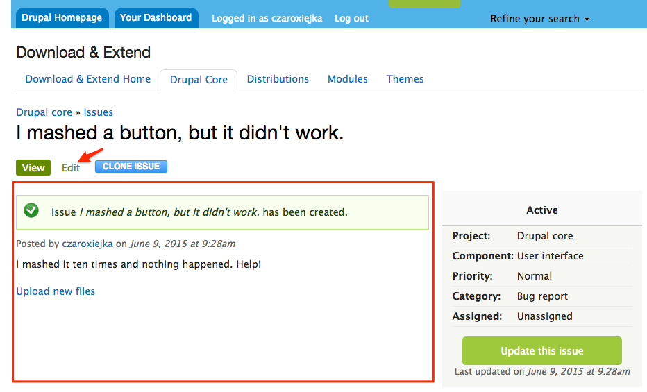
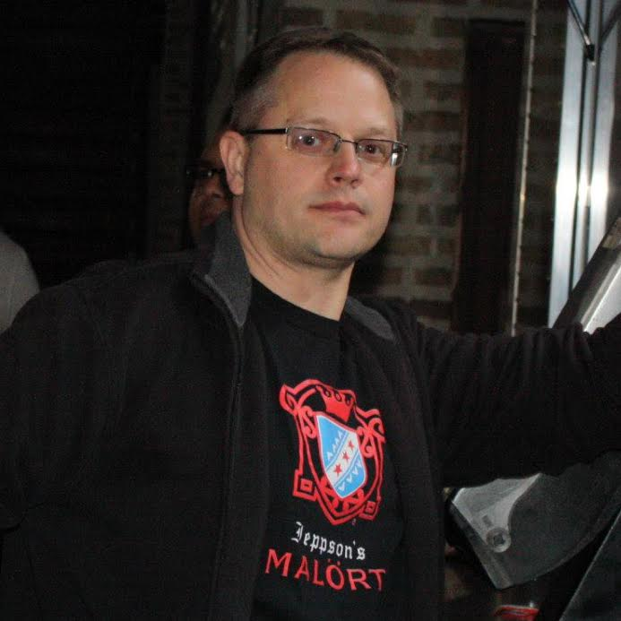

## <i class="fa fa-sign-in"></i> Finding the Entrance
####_Why and how to get involved in the Drupal community_

## [bit.ly/find-entrance](http://bit.ly/find-entrance)

Note:
- Slides and speaker notes available

## Alina Mackenzie

<a href="https://www.drupal.org/u/alimac"><i class="fa fa-drupal"></i> alimac</a>

<a href="https://twitter.com/czaroxiejka"><i class="fa fa-twitter"></i> czaroxiejka</a>

char • o • jay • ka
<!-- .element class="fragment" style="word-spacing: 8px;" -->

Note:
- System administrator and web developer based in Chicago
- Learning organizations, automation and making open source friendly to beginners
- Doing Drupal for ~4 years, active in the community for ~2 years
- Where is the Drupal community?

<!-- .slide: data-background="custom/images/xkcd-online-communities-map.png" data-background-size="680px" data-state="show-header" data-header="Source: xkcd.com/802/" -->

Note:
- "Map of Online Communities" by Randall Munroe of XKCD
- Slightly out of date (circa 2010)
- Drupal and community have been around longer
- ... where is it?

<!-- .slide: data-background="custom/images/xkcd-fragment-1-annotated.png" data-background-size="1280px" data-state="show-header" data-header="Source: xkcd.com/802/" -->

Note:
- Drupal community uses IRC for online chat
- First search location: IRC Isles
- No luck, and too close to Troll Bay

<!-- .slide: data-background="custom/images/xkcd-fragment-2-annotated.png" data-background-size="1280px" data-state="show-header" data-header="Source: xkcd.com/802/" -->

Note:
- Bay of Drama? Buzzword Bay?
- Adrift in the Sea of Opinions

<!-- .slide: data-background="custom/images/isle-of-drupal.jpg" data-background-size="1280px" -->
## Isle of Drupal
<!-- .element: class="hidden" -->

Note:
- Found: Isle of Drupal
- Landmarks, but no detail
- Maps are static, need another approach

## How is Drupal made?

Note:
- Maybe we can get a better picture of how community looks like, how it works by looking at how the project is built?
- Ever wonder what goes into these files?

<!-- .slide: data-background="custom/images/christoph-spiegl-code.jpg" data-state="show-header" data-header="Photo: CC-BY-NC Christoph Spiegl http://flic.kr/p/7DmgDW, cropped" -->
## Code
<!-- .element: class="heading" -->

Note:
- Download Drupal, unpack and open up in a text editor
- Different kinds of code: PHP, HTML, CSS, Javascript
- How did that code get there?
- How do we change the code, and make Drupal even better?

<!-- .slide: data-background="custom/images/amanda-sewing-patches.jpg" data-state="show-header" data-header="Photo: CC-BY-NC-ND amanda https://flic.kr/p/7NSvF, cropped" -->
## Patch
<!-- .element: class="heading invert" -->

Note:
- First let's think about what changes to code are: adding code, removing code
- Changes are grouped together in a set.
- Set of changes is packaged into a file ("patch")

<!-- .slide: data-background="custom/images/amanda-sewing-patches.jpg" data-state="show-header" data-header="Photo: CC-BY-NC-ND amanda https://flic.kr/p/7NSvF, cropped" -->

<!-- .element: class="stretch" -->

Note:
- A patch is a plain text file
- Lines added are marked with +, lines removed are marked with -
- Patch is applied to the project codebase, transforming it
- Where do patches come from?

<!-- .slide: data-background="custom/images/wlodi-big-red-button.jpg" data-state="show-header" data-header="Photo: CC-BY-SA włodi https://flic.kr/p/5GCeGg, cropped" -->
## Starting point
<!-- .element: class="heading invert" -->

Note:
- Someone makes a feature request or reports a bug
- Create a new issue on drupal.org

<!-- .slide: data-background="custom/images/wlodi-big-red-button.jpg" data-state="show-header" data-header="Photo: CC-BY-SA włodi https://flic.kr/p/5GCeGg, cropped" -->
> <i class="fa fa-quote-left"></i>
> I mashed the button, but it didn't do anything.
> <i class="fa fa-quote-right"></i>

Note:
- Not a great description of the problem, but it's a start
- And maybe...

<!-- .slide: data-background="custom/images/wlodi-big-red-button.jpg" data-state="show-header" data-header="Photo: CC-BY-SA włodi https://flic.kr/p/5GCeGg, cropped" -->
> <!-- .element: class="invert" -->
> <i class="fa fa-quote-left"></i>
> Me too!
> <i class="fa fa-quote-right"></i>
> <i class="fa fa-heart fragment current-visible" style="color: #c00;"></i>

Note:
- Someone comes along and adds a "Me too!" comment
- Meetoos are great. Meetoos validate our pain.
- What next?

## Issue summary

Note:
- Original post serves as "issue summary"
- Anyone can add words to the issue summary
- Steps to reproduce, screenshots or screencasts
- Finally...

## A patch appears!

Note:
- Someone writes the first set of changes to the Drupal codebase that fix the problem
- Maybe patch is incomplete
- Maybe automated tests fail
- But...

## Second patch

Note:
- Someone else can build on the work done in the first patch
- Process can be repeated, until the patch is ready to be reviewed

## Review

Note:
- Reviewing is important to the process of making Drupal better
- Does the patch fix the problem?
- Post before and after screenshots
- Check coding standards

## Reviewed and tested by community

Note:
- RTBC
- Drupal core committers review issues that reach RTBC status
- They check the changes and commit, if everything looks OK
- Issue creator, screenshot creator, patch contributors, reviewers all get commit mentions
- Watch this process happen live at 2014 DrupalCamp NYC

<!-- .slide: data-background-video="custom/holly-ross-2014th-contributor.mp4" data-state="show-header" data-header="Drupal Camp NYC 2014 Source: https://youtu.be/RNaPAzhxw58" -->

<!-- .slide: data-background="custom/images/littlelixie-patchwork.jpg" data-state="show-header" data-header="Quilt by Keiko Ohno. Photo: CC-BY-NC Littlelixie https://flic.kr/p/pF4Ekn" -->
## Contributions
<!-- .element: class="heading invert" -->

Note:
- Creating an issue, adding information, posting patches and reviewing are all valuable contributions
- Invisible element: organizing the event
- Let's bring the focus to the *people* that make the Drupal community
- I asked a few people what they do in the community, why they do what they do, and how they got started.

<!-- .slide: data-background="custom/images/eric-the-last.jpg" data-state="show-header" data-header="" style="margin-top: 175px; margin-left: 200px;" -->
## Eric Brown
<!-- .element: class="hidden" -->
> #### Eric Brown <a href="https://www.drupal.org/user/1037606"><i class="fa fa-drupal"></i> ericthelast</a>
> <i class="fa fa-quote-left"></i>
> Eric was the cornerstone of the St. Louis user group. He was always the first to offer help to anyone that needed it, and believed strongly in making Drupal accessible to anyone that had interest.
> <i class="fa fa-quote-right"></i>
> Cecily Borzillo <a href="https://www.drupal.org/u/cecrs"><i class="fa fa-drupal"></i> cecrs</a>
<!-- .element: class="quote-source" -->

Note:
- Starting off with Eric because this camp is dedicated in his memory
- I have not met Eric, but by meeting the St. Louis community I am grateful to experience and appreciate the legacy that Eric built here

<!-- .slide: data-background="custom/images/geerlingguy-photo.jpg" data-background-size="" data-state="show-header" data-header="" style="margin-top: 250px; margin-left: 50px;" -->
## Jeff Geerling
<!-- .element: class="hidden" -->
> <i class="fa fa-quote-left"></i>
> It helps to have a huge network of local and regional friends, whether it be on Twitter, in IRC, or in person.
> <i class="fa fa-quote-right"></i>
> Jeff Geerling <a href="https://www.drupal.org/u/geerlingguy"><i class="fa fa-drupal"></i> geerlingguy</a>
<!-- .element: class="quote-source" -->

Note:
- 7 years with St. Louis meetup group, maintainer of Honeypot module, one of maintainers of Drupal.org Packaging Whitelist
- Local events vs large cons: meet and speak with many more people, sprints are more focused and less overwhelming
- Reviews patches, submits patches and feedback for core and contributed projects

<!-- .slide: data-background="#243F63" -->
## Fredric Mitchell
<!-- .element: class="hidden" -->
> <!-- .element: class="invert" -->
> <i class="fa fa-quote-left"></i>
> I've met a lot of great people, from Minneapolis to New York to Costa Rica and San Francisco. Having a network to lean on and get support from is always helpful.
> <i class="fa fa-quote-right"></i>
> Fredric Mitchell <a href="https://www.drupal.org/u/fmitchell"><i class="fa fa-drupal"></i> fmitchell</a> 
<!-- .element: class="quote-source" -->

Note:
- Mentorship, staying positive and promoting others doing great work
- First got involved through work
- Volunteers and speaks at events, promotes Drupal in all his ventures, including own startup

<!-- .slide: data-background="custom/images/greg-dunlap-cathy-theys.jpg" data-background-size="" data-state="show-header" data-header="Photo: CC-BY Greg Dunlap https://flic.kr/p/eLDNyK" style="margin-top: 200px; margin-left: 150px;" -->
## Cathy Theys
<!-- .element: class="hidden" -->
><i class="fa fa-quote-left"></i>
>Being involved has given me interesting problems to solve, access to interesting smart people, and has taught me a lot about programming and people. <i class="fa fa-quote-right"></i>
> Cathy Theys <a href="https://www.drupal.org/u/yesct"><i class="fa fa-drupal"></i> YesCT</a>
<!-- .element: class="quote-source" -->

Note:
- Works on Drupal core and mentors new contributors
- Improving contribution process for new and ongoing contributors
- Stayed extra days at DrupalCon Denver to join the sprints

<!-- .slide: data-background="#7F141A" -->
## Kevin Thull
<!-- .element: class="hidden" -->
><!-- .element: class="invert" -->
><i class="fa fa-quote-left"></i>
>I used to be that shy guy in the corner, but community involvement has really grown my network and my confidence.
>I wouldn't trade that for anything. <i class="fa fa-quote-right"></i>
>Kevin Thull <a href="https://www.drupal.org/u/kthull"><i class="fa fa-drupal"></i> kthull</a> 
<!-- .element: class="quote-source" -->

Note:
- Meetup and camp organizer, print support for Drupal core mentoring
- Many firsts: working in the issue queue, attending meetups and camps
- Goal: affordable session recording kit
- Shares non-Drupal expertise to fill gaps needed in organizing events
- Superpower: figuring out the mystery of catering

<!-- .slide: data-background="custom/images/kgoel-photo.jpg" data-state="show-header" data-header="Photo: CC-BY Boris Baldinger https://flic.kr/p/paDdif" style="margin-top: 200px;"-->
## Kalpana Goel
<!-- .element: class="hidden" -->
><i class="fa fa-quote-left"></i>
>It has not only helped me become a better developer but I have recognized hidden skills inside me which I wasn't aware of before.
><i class="fa fa-quote-right"></i>
>Kalpana Goel <a href="https://www.drupal.org/u/kgoel"><i class="fa fa-drupal"></i> kgoel</a>
<!-- .element: class="quote-source" -->

Note:
- Tried different areas in span of about 3 years to find the right place: Drupal 8, Symfony
- Contributes patches, reviews, mentors new contributors
- Increased social circle and confidence

<!-- .slide: data-background="custom/images/kandra-photo.jpg" data-state="" data-header="" style="margin-top: 250px; margin-left: 200px;"-->
## Karen Da Cruz
<!-- .element: class="hidden" -->
><i class="fa fa-quote-left"></i>
>It has provided me with plenty of opportunities for growth, exquisite challenges and hard learned lessons.
>And I am not talking about tech alone!
><i class="fa fa-quote-right"></i>
>Karen Da Cruz <a href="https://www.drupal.org/u/kandra"><i class="fa fa-drupal"></i> kandra</a>
<!-- .element: class="quote-source" -->

Note:
- Co-organizer of Drupal Lima meetup: shares knowledge through workshops and talks
- Introduced by a friend to open source: ability to build sustainable career path
- Goal: increase women's participation in the tech community
- Visibility converts into reputation, which gives opportunities to grow career-wise and as a person
- Let's look at the Drupal island one more time

<!-- .slide: data-background="custom/images/isle-of-drupal-sea-routes.jpg" data-background-size="1280px" -->
## Sea routes
<!-- .element: class="hidden" -->

Note:
- Movement: Drupal community is part of intersecting communities
- Communities around technologies like PHP
- Topics: accessibility, multilingual, user experience, automation
- Let's take a look at the many ways you can get involved

## 19
<!-- .element: class="heading" style="font-size: 6em;" -->

Note:
- 19 ways to "enter" the Drupal community
- Not in any particular order
- You might already be doing this stuff!

<!-- .slide: data-background="custom/images/" data-state="show-header" data-header="" -->
### Support
<!-- .element: class="heading" -->

Note:
- Do you like figuring things out? Working out a solution within constraints?
- Support online: forums, chat. In person: at meetups, user groups
- Providing support makes you smarter and trains your empathy

<!-- .slide: data-background="custom/images/" data-state="show-header" data-header="" -->
### Usability testing
<!-- .element: class="heading" -->

Note:
- Do you like to break things? Point out broken things?
- Find and document bugs. You don't have to fix them!
- Test and review patches: do they work?

<!-- .slide: data-background="custom/images/" data-state="show-header" data-header="" -->
### Documentation
<!-- .element: class="heading" -->

Note:
- "Documentation is worth its weight in code."
- All about adding and removing words, like code
- Goal: make things clear and easy to understand

<!-- .slide: data-background="custom/images/" data-state="show-header" data-header="" -->
### Translate
<!-- .element: class="heading" -->

Note:
- Do you know a language that's not English?
- 100+ translations of Drupal
- Fully translated: Ukrainian, Swedish, Spanish
- (I'm still hoping someone will translate Drupal into Klingon)

<!-- .slide: data-background="custom/images/" data-state="show-header" data-header="" -->
### Contribute to Drupal core
<!-- .element: class="heading" -->

Note:
- Remember all the contributions that are made on issues?
- Front-end or back-end: review code, write code
- Always document code: lack of documentation is a bug!

<!-- .slide: data-background="custom/images/" data-state="show-header" data-header="" -->
### Marketing
<!-- .element: class="heading" -->

Note:
- Introduce Drupal to people who haven't heard of it
- Tell someone about how Drupal helped you address your needs
- Boost the signal on social networks

<!-- .slide: data-background="custom/images/" data-state="show-header" data-header="" -->
### Core initiatives
<!-- .element: class="heading" -->

Note:
- Interest areas that have strategic importance for the Drupal projects:
configuration management, design, mobile, multi-lingual, web services
- [MAINTAINERS.txt](http://cgit.drupalcode.org/drupal/tree/core/MAINTAINERS.txt)

<!-- .slide: data-background="custom/images/" data-state="show-header" data-header="" -->
### Attend events
<!-- .element: class="heading" -->

Note:
- Check this one off the list: you are here and you are awesome
- Even if you can't attend in person, watch recorded talks
- Give feedback to presenters: "I really liked... I wish that..."

<!-- .slide: data-background="custom/images/" data-state="show-header" data-header="" -->
### Give talks
<!-- .element: class="heading" -->

Note:
- Great way to learn about a topic
- 20 minute talk about Vagrant: spent many hours getting into the nuts and bolts of Vagrant
- "I'm just a beginner": as a beginner at something, you are already an *expert* at being a beginner

<!-- .slide: data-background="custom/images/" data-state="show-header" data-header="" -->
### Help organize events
<!-- .element: class="heading" -->

Note:
- Putting on events like DrupalCamp St Louis is a tough but rewarding task
- All kinds of skillsets are needed to organize events
- Got spare time? Help organize DrupalCamp St. Louis next year

<!-- .slide: data-background="custom/images/" data-state="show-header" data-header="" -->
### Start a meetup
<!-- .element: class="heading" -->

Note:
- Maybe there aren't any Drupal user groups in your area
- Start your own! It can be hyperlocal: meetup at your workplace, school
- Set up a regular time and place

<!-- .slide: data-background="custom/images/" data-state="show-header" data-header="" -->
### Write blog posts
<!-- .element: class="heading" -->

Note:
- Similar to giving talks, except the audience is not looking right at you
- Describe a particularly frustrating experience and how you solved it
- Blog posts are your personal documentation

<!-- .slide: data-background="custom/images/" data-state="show-header" data-header="" -->
### Make a podcast
<!-- .element: class="heading" -->

Note:
- Somewhere between giving a talk and writing a blog post
- Several Drupal-related podcasts to listen to while you are driving or on a train
- There is always room to make your own!

<!-- .slide: data-background="custom/images/" data-state="show-header" data-header="" -->
### Build a module or theme
<!-- .element: class="heading" -->

Note:
- Contributed projects are mini-Drupal projects
- Important to sustain the core project
- Release your custom code to the community
- Get others to work on it, fund bugs and make improvements

<!-- .slide: data-background="custom/images/" data-state="show-header" data-header="" -->
### Donate
<!-- .element: class="heading" -->
[Drupal 8 Accelerate](https://assoc.drupal.org/d8accelerate)
<!-- .element: class="fragment" -->

Note:
- Drupal is free to use, it's open source
- Working on open source is not free. It costs time (not spent with family, or working to support oneself)
- Drupal 8 Accelerate fund supports work being done on Drupal 8
- Brings people together for critical sprints on important topics

<!-- .slide: data-background="custom/images/" data-state="show-header" data-header="" -->
### Join Drupal Association
<!-- .element: class="heading" -->

Note:
- Drupal association provides community grants and organizes DrupalCons
- Europe, North America, South America, coming in 2016: Asia
- Membership start at $15

<!-- .slide: data-background="custom/images/" data-state="show-header" data-header="" -->
### Sponsor an event
<!-- .element: class="heading" -->

Note:
- Meetups, camps, sprints all need sponsors
- Doesn't always have to be money: offer event space? Buy snacks, coffee and tea, lunch?
- Benefit: meet current and future developers, contributors, project managers, generalists, designers and learners

<!-- .slide: data-background="custom/images/" data-state="show-header" data-header="" -->
### Become a mentor
<!-- .element: class="heading" -->

Note:
- Takes place online and in person
- Online mentoring every week on IRC chat
- In person mentoring at events

<!-- .slide: data-background="custom/images/" data-state="show-header" data-header="" -->
### Encourage others
<!-- .element: class="heading" -->

Note:
- A story from DrupalCon Los Angeles
- One of the most powerful things you can do is give encouragement to another person, and invite them to do something together

<!-- .slide: data-background="custom/images/australian-afternoon.jpg" data-state="show-header" data-header="" -->
## My story
<!-- .element: class="heading invert" -->

Note:
- Went to DrupalCon Denver, Global Sprint Weekend, DrupalCon Portland
- Overwhelming, feeling of inadequacy about making a meaningful contribution
- Global Sprint Weekend 2014: asked about my goals ("what do you want to learn?"), autonomy in defining objectives was powerful
- key benefit: learned to ask questions
- what sustains me: being around *accessibly smart and kind people*

<!-- .slide: data-background="custom/images/nancy-nance-door.jpg" data-state="show-header" data-header="Photo: CC-BY nancynance https://flic.kr/p/srX6Dn" -->
## Tomorrow
<!-- .element: class="hidden" -->
> <i class="fa fa-quote-left"></i>
> When you develop an interest, it usually comes from an environment that de-dramatizes things.
> Because then you’re able to find your own entrance into it.
> <i class="fa fa-quote-right"></i>
> <a href="http://pitchfork.com/thepitch/746-what-happens-when-there-are-no-boys-in-the-room-a-report-from-robyns-tekla-conference/">Robyn</a>
<!-- .element: class="quote-source" -->

Note:
- Sprint tomorrow: people of all skills welcome
- Write down top three things about Drupal (or related technologies) that you are interested in, right now.
- Pick a thing on the list. Maybe break it down into smaller parts, if needed
- Learn it! And ask questions
